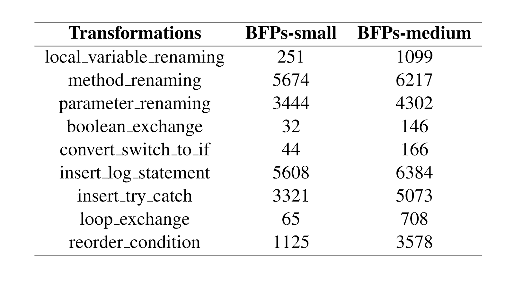
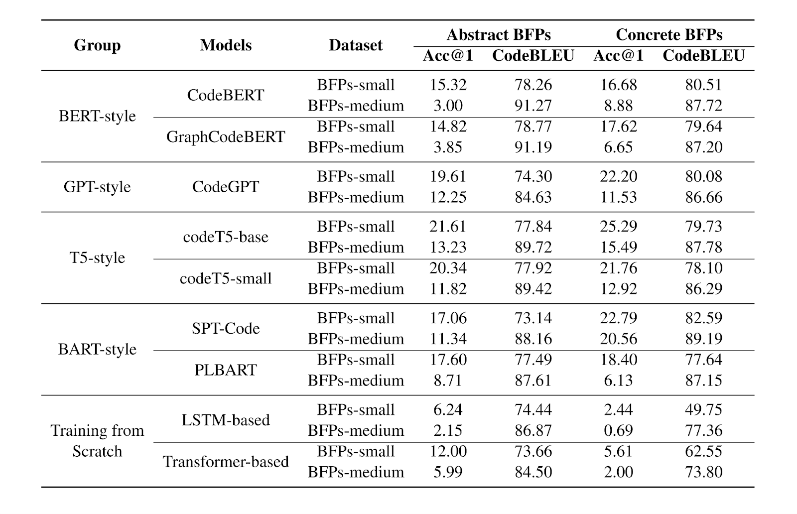
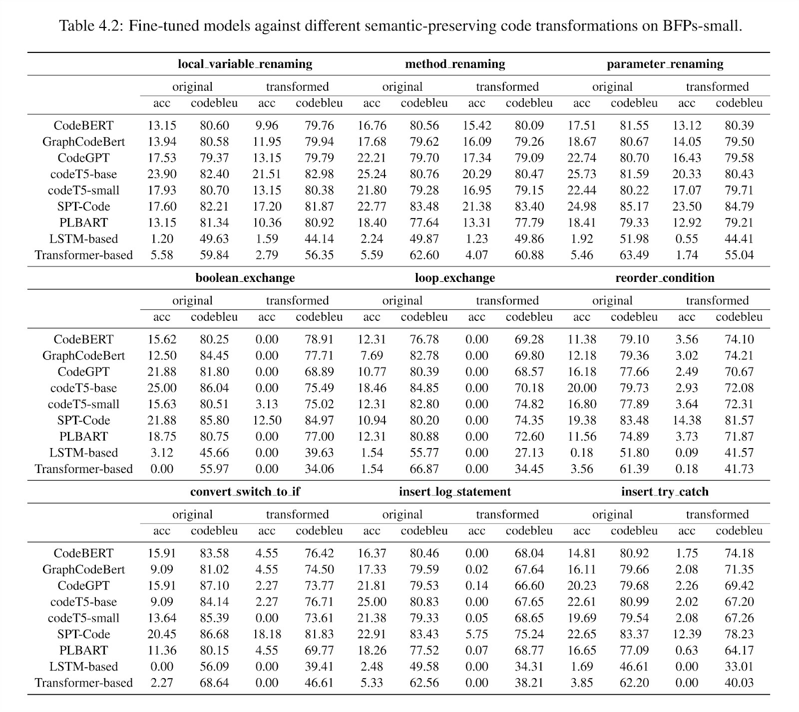
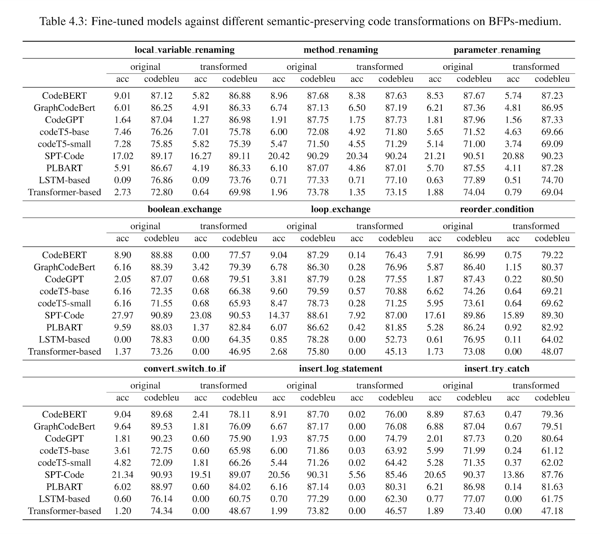

# Pre-Trained Language Models for Automated Program Repair: A Comparative Study on Performance and Robustness

We present the repository of this work, including models, datasets, and code.

## Requirements:

1. `1×Nvidia Tesla V100 GPU with 32GB memory`
2. `Python 3.6`
3. `CUDA 10.1`

Please make sure all the packages in [`requirement.txt`](https://github.com/frabbisw/ReRobust/blob/master/requirements.txt) are installed.

- Run `cat requirement.txt | xargs -n 1 pip install` for setting environment. Please run this twice as some libraries might not be installed due to dependencies.

## Models

### Pre-trained Models for Bug-Fix-Pairs (BFP)

The pre-trained models are released by the corresponding repositories. 
See the instructions in these repositories to download and use these pre-trained models.

- [CodeBERT](https://github.com/microsoft/CodeBERT).
- [GraphCodeBERT](https://github.com/microsoft/CodeBERT/tree/master/GraphCodeBERT).
- [CodeGPT](https://github.com/microsoft/CodeXGLUE).
- [CodeT5](https://github.com/salesforce/CodeT5).
- [PLBART](https://github.com/wasiahmad/PLBART).
- [SPT-Code](https://github.com/NougatCA/SPT-Code).

### Fine-tuned Models for Bug-Fix-Pairs (BFP)

We fine-tune pre-trained models on Abstract BFPs and Concrete BFPs for program repair, respectively.

- Models fine-tuned (trained) on Concrete BFPs can be downloaded from [here](https://zenodo.org/record/7487472#.Y64Jt3bMK3B). transformer-based NMT model on Concrete BFPs can be downloaded from [here](https://drive.google.com/file/d/1rrQzr8JqRpAAT2CLv4xs8VbGtYvM9uHl/view?usp=sharing).
- Models fine-tuned (trained) on Abstract BFPs can be downloaded from [here](https://zenodo.org/record/7487490#.Y64Jq3bMK3B). transformer-based NMT model on Abstract BFPs can be downloaded from [here](https://drive.google.com/file/d/1LfE4J5PeLhV_dZYtiagzLoyZof1AU_Hi/view?usp=sharing).

## Datasets

- Abstract BFPs are initially released by [Tufano et al., 2019](https://sites.google.com/view/learning-fixes/), 
Concrete BFPs are initially released by [Chakraborty & Ray, 2021](https://github.com/modit-team/MODIT). We directly reuse them.
- We also provide a [link](https://drive.google.com/file/d/1xNjo48jOliT7vLmTMOYBRziRocwpDhPg/view?usp=sharing), to download these 2 datasets. Remember to change the directory name "transformed" to "refactoring".
- The 9 transformed datasets and corresponding original datasets are also in the link above. Files named "before_refactoring" stand for original datasets, and files named "after_refactoring" stand for transformed datasets.
- The 9 transformed datasets can be directly used for running RQ2, see the following section "Experiment2 - RQ2". The next section introduce how to generate the transformed datasets.

## How to Generate Transformed Datasets?

**1. For constructing transformed datasets by *local_variable_renaming, method_renaming, parameter_renaming*:**

- We use tree-sitter to parse the code to AST, and identify the target position for renaming an identifier.
- We use naturalness-aware substitution algorithm proposed by [attack-pretrain-models-of-code](https://github.com/soarsmu/attack-pretrain-models-of-code) for generating renaming substitutions.
- `git clone https://github.com/soarsmu/attack-pretrain-models-of-code.git`
- Copy the files "test.buggy-fixed.buggy" (located in \APR-Models-Performance\data\concreteBFPs) of the Small-BFPs and Medium-BFPs to the cloned repository `\attack-pretrain-models-of-code\GraphCodeBERT\clonedetection\dataset\` + `small` or `medium` respectively.
- Copy the files "generate.sh", "generate-substitutes-job.sh" and "get_substitutes1.py" from `\APR-Models-Performance\train\attack-pretrain-models-of-code\GraphCodeBERT\clonedetection\dataset\` to the cloned repository:`\attack-pretrain-models-of-code\GraphCodeBERT\clonedetection\dataset\` in current project (i.e., attack-pretrain-models-of-code).
- Copy the file "my-languages.so" under `\APR-Models-Performance\train\attack-pretrain-models-of-code\python_parser\parser_folder` to the cloned repository `attack-pretrain-models-of-code\python_parser\parser_folder\`.
- Install by `pip install tree-sitter==0.20.1` in your current environment.
- Run the script `bash generate.sh` in interactive job instead of batch job (Concordia ENCS GPU Cluster). Remember to `module load` your libraries.
- Change the `generate-substitutes-medium.jsonl` to `generate-substitutes-small.jsonl` in `generate.sh`, and change the code of line 41 in `get_substitutes1.py`, change `with open('./medium/test.buggy-fixed.buggy')` to `with open('./small/test.buggy-fixed.buggy')`, then rerun `bash generate.sh`.
- Finally, you will obtain 2 files: `generate-substitutes-small.jsonl` and `generate-substitutes-medium.jsonl` as already shown in path `\APR-Models-Performance\refactoring\`. You can copy and cover them again.

So far, you obtain the renaming substitutions list (i.e., 2 .jsonl files above) for the following transformations.

- Run `bash divide_data.sh` under the path `\APR-Models-Performance\refactoring\` for transforming code based on renaming substitutions on the jsonl files above.
- So far, you will obtain the first 3 transformed datasets of *local_variable_renaming, method_renaming, parameter_renaming*, which are located in 'APR-Models-Performance\data\refactoring\'.

**2. For constructing other 6 transformed datasets by *boolean_exchange, loop_exchange, reorder_condition, convert_switch_to_if, insert_log_statement, insert_try_catch*:**

- We use the existing tool proposed by [JavaTransformer](https://github.com/mdrafiqulrabin/JavaTransformer).
- `git clone https://github.com/mdrafiqulrabin/JavaTransformer.git`
- As this tool only accept .java file, first we transform each line of code in testing dataset to .java file to fit the input of this tool.
- Check the path in line 10-13 in `\APR-Models-Performance\refactoring\line_to_file.py` to fit your computer's environment.
- Run `Python line_to_file.py`, to convert each line of code to one .java file.
- You will obtain the transformed files of Small-BFPs and Medium-BFPs, which located in `\APR-Models-Performance\refactoring\`.
- Copy the transformed files of Small-BFPs and Medium-BFPs to `\JavaTransformer\data\small` and `\JavaTransformer\data\medium` respectively.
- Run `Main.java` on path `JavaTransformer\src\main\java`, to start transforming each Java file.
- You will obtain the transformed files, then you need to construct these .java files back to transformed dataset files.
- Check the path in line 13 in `\APR-Models-Performance\refactoring\file_to_line.py` to fit your computer's environment.
- Run `Python file_to_line.py` to construct the datasets.
- So far, you will obtain the 6 transformed datasets by *boolean_exchange, loop_exchange, reorder_condition, convert_switch_to_if, insert_log_statement, insert_try_catch*.
- For viewing the transformed datasets, check whether there are 9 transformations directories under path `\APR-Models-Performance\refactoring\`.

Finally, you will obtain the transformed datasets, the statistics of these datasets are shown the figure below:

## Experiment1 - RQ1

Please make sure the environment libraries mentioned above installed.

**1. For fine-tuning CodeBERT, GraphCodeBERT, CodeGPT and PLBART, we reuse the code from [MODIT](https://github.com/modit-team/MODIT). We also reuse their work for training LSTM and Transformer:**

- `git clone https://github.com/modit-team/MODIT`
- Following the original instructions in [MODIT](https://github.com/modit-team/MODIT) to fine-tune/train these models.

**2. For fine-tuning CodeT5, SPT-Code:**
- `git clone https://github.com/salesforce/CodeT5`
- Following the original instructions in [CodeT5](https://github.com/salesforce/CodeT5) to fine-tune it.
- `git clone https://github.com/NougatCA/SPT-Code`
- Following the original instructions in [SPT-Code](https://github.com/NougatCA/SPT-Code) to fine-tune it.

**RQ1: What is the repair performance of different DL-based APR models?**

## Experiment2 - RQ2

Please make sure the environment libraries mentioned above installed.

**1. For testing the robustness of CodeBERT, GraphCodeBERT, CodeGPT, PLBART(MODIT), LSTM-based and Transformer-based models:**

- Models:

   - Download fine-tuned models, then put the fine-tuned models on the corresponding directories (explained in the next step).
   - For example, CodeBERT model fine-tuned on small-BFPs of Concrete BFPs should be under the path: `APR-Models-Performance/models/original/codebert/small/pytorch_model.bin`

- Dataset:

   - Download transformed dataset mentioned above, put it under the path: `APR-Models-Performance/data/refactoring/`

- Script:

  - Run scripts under path: `APR-Models-Performance/generate/`, such as `codebert-generate-job.sh`.
  - Make sure to check scripts before running, fit the recent changes of GPU cluster.
  - After running job, you will obtain a log file under the same path. Check it and check `Accuracy` and `CodeBLEU` in the final stage of log to verify the value with the thesis.

**2. For testing the robustness of SPT-Code:**

We will directly use SPT-Code repository to perform RQ2, so download it first by 
- `git clone https://github.com/NougatCA/SPT-Code.git`. Then prepare the fine-tuned models, datasets and scripts.

- Models:

  - Download fine-tuned SPT-Code on small-BFPs and medium-BFPs, then put them under `SPT-Code/fine_tuned_models_final/small/` and `SPT-Code/fine_tuned_models_final/medium/`

- Dataset:

  - Download transformed dataset mentioned above, copy it under the path: `CodeT5/data/refactoring/`

- Script:

  - Run `SPT-Code/sources/spt-generate-job.sh`. This file is currently located in `/APR-Models-Performance/train/SPT-Code/sources/spt-generate-job.sh`, so copy it to your current SPT-Code.
  - Make sure to check scripts before running, fit the recent changes of GPU cluster.
  - After running job, you will obtain a log file under the same path. Check it and check `Accuracy` and `CodeBLEU` in the final stage of log to verify the value with the thesis.

**3. For testing the robustness of CodeT5:**

We will directly use SPT-Code repository to perform RQ2, so download it first by 
- `git clone https://github.com/salesforce/CodeT5.git`. Then prepare the fine-tuned models, datasets and scripts.

- Models:
  - Download fine-tuned CodeT5-small on small-BFPs and medium-BFPs, then put them under `CodeT5/sh/fine_tuned_models_final/codet5-small/small/pytorch_model.bin` and `CodeT5/sh/fine_tuned_models_final/codet5-small/medium/pytorch_model.bin`
  - Download fine-tuned CodeT5-base on small-BFPs and medium-BFPs, then put them under `CodeT5/sh/fine_tuned_models_final/codet5-base/small/pytorch_model.bin` and `CodeT5/sh/fine_tuned_models_final/codet5-base/medium/pytorch_model.bin`

- Dataset:

  - Download transformed dataset mentioned above, put it under the path: `/refactoring-dataset`. Note that this path should be same as SPT-Code path. 

- Script:

  - Run `CodeT5/sh/codet5-generate-job.sh` and `codet5base-generate-job.sh`. (This file is currently located in `/APR-Models-Performance/train/CodeT5/sh/codet5-generate-job.sh`, so copy it to your current CodeT5.)
  - After running job, you will obtain a log file under the same path. Check it and check `Accuracy` and `CodeBLEU` in the final stage of log to verify the value with the thesis.

**RQ2: What is the repair robustness of different DL-based APR models against different semantic-preserving code transformations?**

## Code Structure

- ../data: Abstract BFPs and Concrete BFPs. The transformed dataset should also be here after you download it.

- ../train: fine-tuning (training) code, see the corresponding original mentioned above for details.

- ../generate: bash file for fine-tuning and inference.

- ../evaluate: calculate Accuracy@1 and CodeBLEU.

- ../preprocess: preprocess and binary code.

- ../refactoring: define 3 renaming-related semantic-preserving transformations and renaming substitution JSON file generated by GraphCodeBERT's masked language modeling.

### Acknowledgement

We use [MODIT](https://github.com/modit-team/MODIT), [PLBART](https://github.com/wasiahmad/PLBART), [Fairseq](https://github.com/pytorch/fairseq), 
[CodeBERT](https://github.com/microsoft/CodeBERT), [codeXglue](https://github.com/microsoft/CodeXGLUE), [SPT-Code](https://github.com/NougatCA/SPT-Code), 
[CodeT5](https://github.com/salesforce/CodeT5), [attack-pretrain-models-of-code](https://github.com/soarsmu/attack-pretrain-models-of-code), 
[JavaTransformer](https://github.com/mdrafiqulrabin/JavaTransformer), [Tufano et al.](https://sites.google.com/view/learning-fixes/).
We are very grateful that the above works make their code, datasets, and models publicly available so that we can build this repository on top of their works.

### Data Source

The repos used for the BFP dataset are listed [here](https://www.google.com/url?q=https%3A%2F%2Fzenodo.org%2Frecord%2F7478730%2Ffiles%2Fbugfixing-commits.csv.zip%3Fdownload%3D1&sa=D&sntz=1&usg=AOvVaw3RjInJT9UhWYf1ZRkllnwf).

