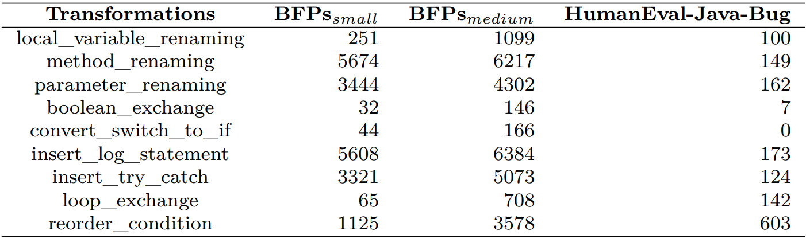

Yu Shi Master Thesis Project - Concordia University

# Evaluating the Robustness of Deep Learning Models on Automated Program Repair

We present the repository of this work, including models, datasets, and code.

## Requirements:

1. `1×Nvidia Tesla V100 GPU with 32GB memory`
2. `Python 3.6`
3. `CUDA 10.1`

Please make sure all the packages in [`requirement.txt`](https://github.com/ThomasShiyu/APR-Models-Performance/blob/master/config/requirement.txt) are installed.

- Run `cat requirement.txt | xargs -n 1 pip install` for setting environment.

## Models

### Pre-trained Models

The pre-trained models are released by the corresponding repositories. 
See the instructions in these repositories to download and use these pre-trained models.

- [CodeBERT](https://github.com/microsoft/CodeBERT).
- [GraphCodeBERT](https://github.com/microsoft/CodeBERT/tree/master/GraphCodeBERT).
- [CodeGPT](https://github.com/microsoft/CodeXGLUE).
- [CodeT5](https://github.com/salesforce/CodeT5).
- [PLBART](https://github.com/wasiahmad/PLBART).
- [SPT-Code](https://github.com/NougatCA/SPT-Code).

### Fine-tuned Models

We fine-tune pre-trained models on Abstract BFPs and Concrete BFPs for program repair, respectively.

- Models fine-tuned (trained) on Concrete BFPs can be downloaded from [here](https://zenodo.org/record/7487472#.Y64Jt3bMK3B). transformer-based NMT model on Concrete BFPs can be downloaded from [here](https://drive.google.com/file/d/1rrQzr8JqRpAAT2CLv4xs8VbGtYvM9uHl/view?usp=sharing).
- Models fine-tuned (trained) on Abstract BFPs can be downloaded from [here](https://zenodo.org/record/7487490#.Y64Jq3bMK3B). transformer-based NMT model on Abstract BFPs can be downloaded from [here](https://drive.google.com/file/d/1LfE4J5PeLhV_dZYtiagzLoyZof1AU_Hi/view?usp=sharing).

## Datasets

- Abstract BFPs are initially released by [Tufano et al., 2019](https://sites.google.com/view/learning-fixes/), 
Concrete BFPs are initially released by [Chakraborty & Ray, 2021](https://github.com/modit-team/MODIT). We directly reuse them.
- We also provide a [link](https://drive.google.com/file/d/1xNjo48jOliT7vLmTMOYBRziRocwpDhPg/view?usp=sharing), to download these 2 datasets. Remember to change the directory name "transformed" to "refactoring".
- The 9 transformed datasets and corresponding original datasets are also in the link above. Files named "before_refactoring" stand for original datasets, and files named "after_refactoring" stand for transformed datasets.
- The 9 transformed datasets can be directly used for running RQ2, see the following section "Experiment2 - RQ2". The next section introduce how to generate the transformed datasets.

## How to Generate Transformed Datasets?

**1. For constructing transformed datasets by *local_variable_renaming, method_renaming, parameter_renaming*:**

- We use naturalness-aware substitution algorithm proposed by [attack-pretrain-models-of-code](https://github.com/soarsmu/attack-pretrain-models-of-code).
- `git clone https://github.com/soarsmu/attack-pretrain-models-of-code.git`
- Copy the files "test.buggy-fixed.buggy" of the Small-BFPs and Medium-BFPs of concrete BFPs to `\train\attack-pretrain-models-of-code\GraphCodeBERT\clonedetection\` + `small` or `medium` respectively.
- Copy the files "generate.sh", "generate-substitutes-job.sh" and "get_substitutes1.py" from `\APR-Models-Performance\train\attack-pretrain-models-of-code\GraphCodeBERT\clonedetection\dataset\` to `\attack-pretrain-models-of-code\GraphCodeBERT\clonedetection\dataset\`.
- Run the script `generate-substitutes-job.sh`.
- Remember to change the `generate-substitutes-medium.jsonl` to `generate-substitutes-small.jsonl` in `generate.sh`, then rerun `generate-substitutes-job.sh`.
- Finally you will obtain 2 files: `generate-substitutes-small.jsonl` and `generate-substitutes-medium.jsonl` as already shown in path `\APR-Models-Performance\refactoring\`. You can copy and cover them again.
- Run `Bash divide_data.sh` under the path `\APR-Models-Performance\refactoring\`.
- So far, you will obtain the first transformed datasets by *local_variable_renaming, method_renaming, parameter_renaming*.

**2. For constructing transformed datasets by *boolean_exchange, loop_exchange, reorder_condition, convert_switch_to_if, insert_log_statement, insert_try_catch*:**

- We use the existing tool proposed by [JavaTransformer](https://github.com/mdrafiqulrabin/JavaTransformer).
- `git clone https://github.com/mdrafiqulrabin/JavaTransformer.git`
- As this tool only accept .java file, first you need you transform each line of code in testing dataset to .java file.
- Check the path in line 10-13 in `\APR-Models-Performance\refactoring\line_to_file.py` to fit your computer's environment.
- Run `Python line_to_file.py`.
- You will obtain the transformed files of Small-BFPs and Medium-BFPs.
- Copy the transformed files of Small-BFPs and Medium-BFPs to `\JavaTransformer\data\small` and `\JavaTransformer\data\medium` respectively.
- Run `Main.java` on path `JavaTransformer\src\main\java`.
- You will obtain the files of transformed datasets, then you need to construct these .java files back to transformed dataset files.
- Check the path in line 13 in `\APR-Models-Performance\refactoring\file_to_line.py` to fit your computer's environment.
- Run `Python file_to_line.py`.
- So far, you will obtain the first transformed datasets by *boolean_exchange, loop_exchange, reorder_condition, convert_switch_to_if, insert_log_statement, insert_try_catch*.

Finally, you will obtain the transformed datasets, the statistics of these datasets are shown the figure below:

## Experiment1 - RQ1

Please make sure the environment libraries mentioned above installed.

**1. For fine-tuning CodeBERT, GraphCodeBERT, CodeGPT and PLBART, we reuse the code from [MODIT](https://github.com/modit-team/MODIT):**

- `git clone https://github.com/modit-team/MODIT`
- Following the original instructions in [MODIT](https://github.com/modit-team/MODIT) to fine-tune these models.

**2. For fine-tuning CodeT5, SPT-Code:**
- `git clone https://github.com/salesforce/CodeT5`
- Following the original instructions in [CodeT5](https://github.com/salesforce/CodeT5) to fine-tune it.
- `git clone https://github.com/NougatCA/SPT-Code`
- Following the original instructions in [SPT-Code](https://github.com/NougatCA/SPT-Code) to fine-tune it.

**RQ1: What is the repair performance of different DL-based APR models?**

## Experiment2 - RQ2

Please make sure the environment libraries mentioned above installed.

**1. For testing the robustness of CodeBERT, CodeGPT, PLBART(MODIT), LSTM-based and Transformer-based models:**

- Models:

   - Download fine-tuned models, then put the fine-tuned models on the corresponding directories.
   - For example, CodeBERT model fine-tuned on small-BFPs of Concrete BFPs should be under the path: `APR-Models-Performance/models/original/codebert/small/pytorch_model.bin`

- Dataset:

   - Download transformed dataset mentioned above, put it under the path: `APR-Models-Performance/data/refactoring/`

- Script:

  - Run scripts under path: `APR-Models-Performance/generate/`, such as `codebert-generate-job.sh`.
  - Make sure to check scripts before running, fit the recent changes of GPU cluster.

**2. For testing the robustness of SPT-Code:**

- Models:

  - Download fine-tuned SPT-Code on small-BFPs and medium-BFPs, then put them under `SPT-Code/fine_tuned_models_final/small/` and `SPT-Code/fine_tuned_models_final/medium/`

- Dataset:

  - Download transformed dataset mentioned above, put it under the path: `CodeT5/data/refactoring/`

- Script:

  - Run `SPT-Code/sources/spt-generate-job.sh`

**3. For testing the robustness of CodeT5:**

- Models:
  - Download fine-tuned CodeT5-small on small-BFPs and medium-BFPs, then put them under `CodeT5/sh/fine_tuned_models_final/codet5-small/small/pytorch_model.bin` and `CodeT5/sh/fine_tuned_models_final/codet5-small/medium/pytorch_model.bin`
  - Download fine-tuned CodeT5-base on small-BFPs and medium-BFPs, then put them under `CodeT5/sh/fine_tuned_models_final/codet5-base/small/pytorch_model.bin` and `CodeT5/sh/fine_tuned_models_final/codet5-base/medium/pytorch_model.bin`

- Dataset:

  - Download transformed dataset mentioned above, put it under the path: `/refactoring-dataset`. Note that this path should be same as SPT-Code path. 

- Script:

  - Run `CodeT5/sh/codet5-generate-job.sh` and `codet5base-generate-job.sh`

**RQ2: What is the repair robustness of different DL-based APR models against different semantic-preserving code transformations?**

## Code Structure

- ../data: Abstract BFPs and Concrete BFPs.

- ../train: fine-tuning (training) code, see the corresponding original mentioned above for details.

- ../generate: bash file for fine-tuning and inference.

- ../evaluate: calculate Accuracy@1 and CodeBLEU.

- ../preprocess: preprocess and binary code.

- ../refactoring: define 3 renaming-related semantic-preserving transformations and renaming substitution JSON file generated by GraphCodeBERT's masked language modeling.

For running RQ1, see the instructions in corresponding repositories on how to fine-tune pre-trained models.

For running RQ2, see scripts under ../generate and put datasets and fine-tuned models on corresponding directories. See [attack-pretrain-models-of-code](https://github.com/soarsmu/attack-pretrain-models-of-code) for the details on utilizing pre-trained models to predict masked tokens for renaming-related transformations. See [JavaTransformer](https://github.com/mdrafiqulrabin/JavaTransformer) for the detailed implementation of the other six semantic-preserving transformations.

### Acknowledgement

We use [MODIT](https://github.com/modit-team/MODIT), [PLBART](https://github.com/wasiahmad/PLBART), [Fairseq](https://github.com/pytorch/fairseq), 
[CodeBERT](https://github.com/microsoft/CodeBERT), [codeXglue](https://github.com/microsoft/CodeXGLUE), [SPT-Code](https://github.com/NougatCA/SPT-Code), 
[CodeT5](https://github.com/salesforce/CodeT5), [attack-pretrain-models-of-code](https://github.com/soarsmu/attack-pretrain-models-of-code), 
[JavaTransformer](https://github.com/mdrafiqulrabin/JavaTransformer), [Tufano et al.](https://sites.google.com/view/learning-fixes/).
We are very grateful that the above works make their code, datasets, and models publicly available so that we can build this repository on top of their works.

